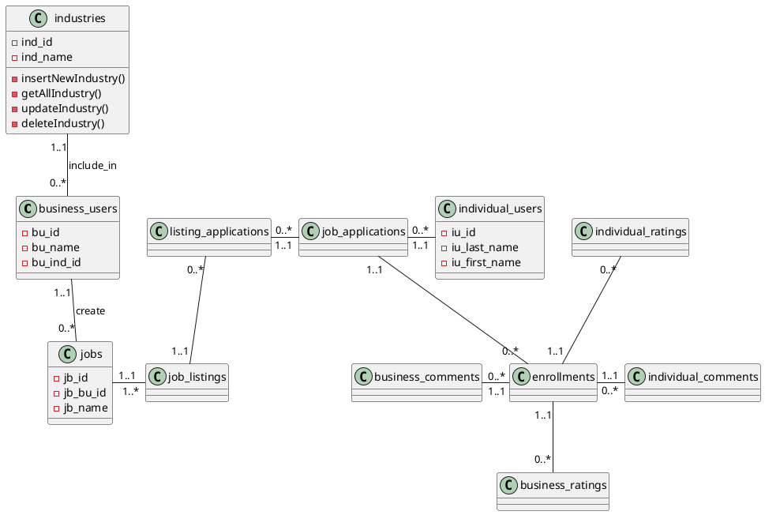

# Manbase API Server

## Class Diagram

```plantuml
@startuml
    class business_users {
        - bu_id
        - bu_name
        - bu_ind_id
    }

    class industries {
        - ind_id
        - ind_name
        - insertNewIndustry()
        - getAllIndustry()
        - updateIndustry()
        - deleteIndustry()
    }

    class jobs {
        - jb_id
        - jb_bu_id
        - jb_name

    }

    class job_listings {

    }

    class listing_applications {

    }

    class job_applications {

    }

    class individual_users {
        - iu_id
        - iu_last_name
        - iu_first_name
    }

    class enrollments {

    }

    class business_ratings {

    }

    class business_comments {

    }

    class individual_ratings {

    }

    class individual_comments {

    }

    industries "1..1" -- "0..*" business_users : include_in

    business_users "1..1" --"0..*" jobs: create

    jobs "1..1" - "1..*" job_listings

    listing_applications "0..*" -- "1..1" job_listings

    listing_applications "0..*" - "1..1" job_applications

    job_applications "0..*" - "1..1" individual_users

    job_applications "1..1" -down- "0..*" enrollments

    business_ratings "0..*" -up- "1..1" enrollments

    business_comments "0..*" - "1..1" enrollments

    individual_ratings "0..*" -- "1..1" enrollments

    individual_comments "0..*" -left- "1..1" enrollments

    together {
        class individual_users
        class business_users
    }

    together {
        class individual_ratings
        class individual_comments
    }

    together {
        class business_ratings
        class business_comments
    }
@enduml
```
