# Manbase API Server

## Class Diagram

```plantuml
@startuml
    class business_users {
        - bu_id
        - bu_address
        - bu_CName
        - bu_EName
            'english and chinese name
        - bu_phone
        - bu_isSMSVerified
        - bu_businessLogo
        - bu_brc
            'business registration certification
        - bu_isBusinessVerified
            'verification: True or False

'function
        - createBusinessProfile()
            'register business user
        - viewBusinessProfile()
        - updateBusinessProfile()
        - deleteBusinessProfile()
        - updateBusinessPhone()
    }

    class individual_users {
    'attributes
        - iu_id
        - iu_phone
        - iu_isSMSVerified
            'for SMS verification
        - iu_profilePicture
            'profile picture [opt]
        - iu_hkid
        - iu_passport
            'for real identity verification [opt]
        - iu_isIdentityVerified
            'real identity verification: True or False
        - iu_CName
        - iu_EName
        - iu_alias
            'one name
        - iu_gender
        - iu_birthday
        - iu_educationLevel
            'primary secondary school, tertiary...
        '- (TBC) iu_selfIntroduction
            'string data, may be have identity disclosure isuue (?) [opt]
        - iu_language_Cantonese
        - iu_language_English
        - iu_language_Putonghua
            'capable work lanuage: ture or false
        - iu_language_Other
            'user specified language: str [opt]

    'functions
        - uploadProfilePicture()
        - viewProfilePicture()
        - deleteProfilePicture()
            'profile pic
        - createIndividualProfile()
            'register
        - viewIndividualProfile()
        - updateIndividualProfile()
            'for non compulsary attributes
        - deleteIndividualProfile()
            'individual account
        - identityVerification()
            'submit hkid/passport
        - changePassword()
        - updateIdentityVerificationStatus()
            'not sure if put here (?)
        - updateSMSVerificationStatus()
            'not sure if need put
        - showIndividualReview()
        - viewApplicant()
            'view job applicant: personal info., rating stat, comment,
        - updateIndividualPhone()

    }

    class jobs {
    'attributes
        - jb_creationTime
        - jb_id
        '- jb_type
            'added a new job_type class
        - jb_location
            'tuple type (?), or string (?)
        - jb_description
            'collapsed with job type description(?)
        - jb_expected_payment_period
            'instead of job payment day (moved to job_listing)

    'functions
        - createJob()
        - viewJob()
            'view specific job detail (?) or job board
        - updateJob()
            'edit job
        - deleteJob()
            'cancel job for business user

        - displayByType()
        - displayBySalary()
        - displayByLocation()
            'filter function for job board
        - showPostedJob()
            'business

    }

    class job_abnormality{
    'attribute
        - jab_creationTime
        - jab_id
        - jab_li_id
            'can be null
        - jab_job_id
        - jab_sender
            'store user id
        - jab_description
        - jab_isSolved

    'function
        - create()
        - view()
       '- update() : should be banned(?)
        - delete()

        - solve()
            'change jab_isSolved to True

    }

    class job_type {
    'attirbutes
        - jt_id
        - jt_name
        - jt_description
            'not sure if a good measure(?)

    'functions
        - create()
        - view()
        - update()
        - Delete()
    }

    class job_listings {
    'attributes
        - li_id
        - li_jb_id
        '- li_jb_date
            'can be represented by start time - end time (?)
        - li_starttime
        - li_endtime
        - li_salary_amt
            ' in number
        - li_salary_type
            ' in hr rate or day rate or lump sum: salary structure
        - li_quota
            'the amount for workforce needed
        - 'jb_expected_payment_days
            'put here better (?)

        'functions
        - create()
        - update()
        - view()
            'view listing detail
        - delete()
            'cancel job post: not allowed when more than one enrolled individual
    }

    class job_applications {
    'attribute
        - ap_creationTime
            'application time for waitlist
        - ap_id
        - ap_li_id
            'listed job
        - ap_iu_id
            'applicant
        - ap_status
            'enrollment status, can be waitlist

    'function
        - create()
            'apply for job
        - delete()
            'withdraw job application
        - update()
            'for admin
        - view()
            'view my job for individual/ view applicants (?)

        - showApplicant(job)
            '(?)
        - approve()
            'change of status from applied to approved by business
        - accept()
            'change of status from approved to accepted by individual
        - decline()
            'change of status from approved to declined by individual

        }

    'class waitlist {
        '- wl_id
       ' - wl_ap_id
        '- wl_iu_id
        '- wl_time
            'decide waitlist position

    '}

    class enrollments {
    'attribute
        - en_creationTime
            'enrollment time
        - en_id
        - en_ap_id
        - en_li_id
        - en_is_paid
        - en_is_on_time
            'True or False
        - en_is_present
            'attendance: True or False
    'function
        - create()
        - update()
        - view()
        - delete()

        - viewEmployee()
            'view enrolled individual for a specific job
        - confirmAttendance()
            'change attendance status of individual, by employer
        -
    }

    class announcement {
    'reply & announcement merged, canvas discussion board (?)

    'attribute
        - an_creationTime
        - an_id
        - an_sender_id
        - an_receiver_id
            'how about mass message(?)
        - an_message

    'function
        - create()
            'release a message
        - 'update()
            'not allowed (?)
        - view()
            'business or individual
        - delete()
            'not allowed after certain time


    }

    class announcement_listings {
        - an_id
        - li_id
    }

    class industry {
    'attribute
        - id_id
        - id_name
    'function
        - create()
        - update()
        - view()
        - delete()
    }

    class users {
        - ur_creationTime
        - ur_id
        - ur_login_name
        - ur_password_hash
    }

    class rating_category {
    'attrbute
        - rc_id
        - rc_name
            'Workload, Work Environment, Administration: 1-5 scale
            '-2, -1, 0, 1, 2 scale for individual performance
    'function
        - create()
        - view()
        - update()
        - delete()
    }

    class rating {
    'attribute
        - ra_re_id
        - ra_rc_id
        - ra_rating

    'function
        - createRating()
        - viewRating()
        - updateRating()
            'for admin
        - deleteRating()
            'for admin

        - getAverageRating()
            'display on individual profile / job application
    }

    class review {
    'attribute
        - re_id
        - re_en_id
        - re_type
            're_type can be of 'comment' or 'violation' or 'abnormality'
        - re_receiver_id
        - re_sender_id
        - re_comment
        - re_isFollowUpNeeded
            'for the payment day later than review day: True or False

    'function
        - viewReview()
            'view comment
        - createReview()
        - updateReview()
            'for admin(?), how about 追數 (?)
        - deleteReview()
            'for admin(?)

    }

    class review_followup{
    'attribute
        -rf_id
        -rf_re_id
        -rf_expected_time
            'the expected day of salary payment
        -rf_comment

    'function
        - viewFollowUp()
        - createFollowUp()
        - updateFollowUp()
            'make follow-up review
        - deleteFollowUp()
            'for admin

    }

    users "1..1" -- "0..M" announcement: create

    announcement "1..1" -- "0..M" announcement: reply

    users "1..1" -- "1..M" individual_users: is

    users "1..1" -- "1..M" business_users: is

    industry "1..1" -- "0..M" business_users: in_industry

    business_users "1..1" -- "1..M" jobs

    job_listings "1..1" - "0..M" job_applications: apply

    jobs "1..1" -- "1..M" job_listings

    jobs "0..M" -- "1..1" job_type

    jobs "1..1" -- "0..M" job_abnormality

    job_applications "0..M" -up- "1..1" individual_users

    job_listings "1..1" -- "0..M" enrollments

    job_listings "0..1" -- "0..M" job_abnormality

    job_applications "1..1" -- "0..M" enrollments

    announcement "1..1" -- "1..M" announcement_listings

    announcement_listings "0..M" -- "1..1" job_listings

    enrollments "1..1" -- "0..M" review

    review "1..1" -left- "1..M" rating

    review "0..M" -- "1..1" users

    review "1..1" -- "0..1" review_followup

    rating "1..1" -- "0..M" rating_category
@enduml
```



```sql

```

## Server Connection Info

### SSH

Server: manbase-api.williswcy.com
Account: root
Password: eqh49-v3bnb

### MySQL

Server Host: manbase-api.williswcy.com
Account: charlescly / lancetpk / williswcy
Password: Same as the account name
Note: Please update your password with the following SQL command -

```sql
UPDATE mysql.user SET Password = PASSWORD('{your_new_password}') WHERE user = '{your_account}';
```
