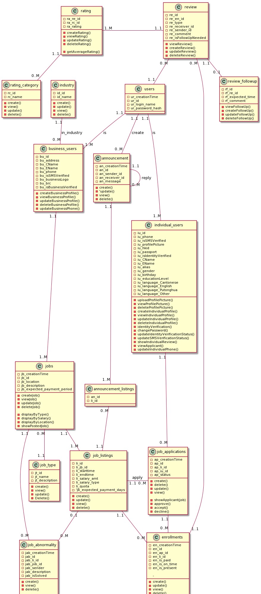

# Manbase API Server

## Class Diagram



## Server Connection Info

### SSH

- Server: `manbase-api.williswcy.com` or `test.manbasehk.com`
- Account: root
- Password: eqh49-v3bnb
- Location: ~/manbase
- Start the testing server by -

```
cd manbase
pipenv shell
gunicorn run:app
```

- The website should then be accessible remotely via `https://test.manbasehk.com/`.

### MySQL

- Server Host: `manbase-api.williswcy.com` or `test.manbasehk.com`
- Account: charlescly / lancetpk / williswcy
- Password: Same as the account name
- Note: Please update your password with the following SQL command -

```sql
UPDATE mysql.user SET Password = PASSWORD('{your_new_password}') WHERE user = '{your_account}';
```

- Start the MySQL prompt with `mysql`, or connect remotely.
- Note the `public` (currently) has `SELECT`, `UPDATE` and `INSERT` prviledges on all tables of `manbasdb`.
- The password of `public` is `b05qv-x4xca`.
