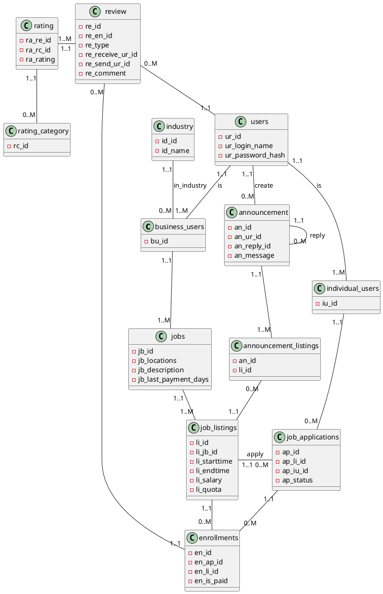

# Manbase API Server

## Class Diagram


```plantuml
@startuml
    class business_users {
        - bu_id
    }

    class individual_users {
        - iu_id
    }

    class jobs {
        - jb_id
        - jb_locations
        - jb_description
        - jb_last_payment_days
    }

    class job_listings {
        - li_id
        - li_jb_id
        - li_starttime
        - li_endtime
        - li_salary
        - li_quota
    }

    class job_applications {
        - ap_id
        - ap_li_id
        - ap_iu_id
        - ap_status
    }

    class enrollments {
        - en_id
        - en_ap_id
        - en_li_id
        - en_is_paid
    }

    class announcement {
        - an_id
        - an_ur_id
        - an_reply_id
        - an_message
    }

    class announcement_listings {
        - an_id
        - li_id
    }

    class industry {
        - id_id
        - id_name
    }

    class users {
        - ur_id
        - ur_login_name
        - ur_password_hash
    }

    class rating_category {
        - rc_id
    }

    class rating {
        - ra_re_id
        - ra_rc_id
        - ra_rating
    }

    class review {
        - re_id
        - re_en_id
        - re_type
        ' re_type can be of 'comment' or 'violation' or 'abnormality'
        - re_receive_ur_id
        - re_send_ur_id
        - re_comment
    }

    users "1..1" -- "0..M" announcement: create

    announcement "1..1" -- "0..M" announcement: reply

    users "1..1" -- "1..M" individual_users: is

    users "1..1" -- "1..M" business_users: is

    industry "1..1" -- "0..M" business_users: in_industry

    business_users "1..1" -- "1..M" jobs

    job_listings "1..1" - "0..M" job_applications: apply

    jobs "1..1" -- "1..M" job_listings

    job_applications "0..M" -up- "1..1" individual_users

    job_listings "1..1" -- "0..M" enrollments

    job_applications "1..1" -- "0..M" enrollments

    announcement "1..1" -- "1..M" announcement_listings

    announcement_listings "0..M" -- "1..1" job_listings

    enrollments "1..1" -- "0..M" review

    review "1..1" -left- "1..M" rating

    review "0..M" -- "1..1" users

    rating "1..1" -- "0..M" rating_category
@enduml
```

```sql
CREATE VIEW individual_user_rating AS
SELECT

```
