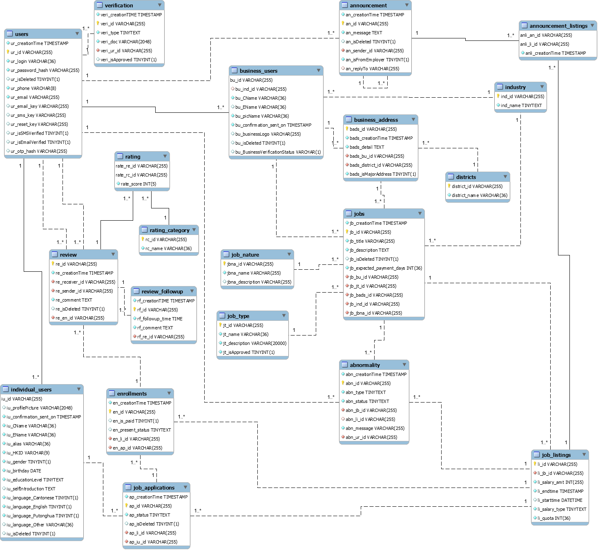

# Manbase Web Server

Run program in your local device:

```$python run.py```

<!-- TOC -->

- [Manbase Web Server](#manbase-web-server)
- [Server Connection Info](#server-connection-info)
    - [SSH](#ssh)
    - [MySQL](#mysql)
- [Class Diagram](#class-diagram)
- [Schema documentation [As of 31st July 2020]](#schema-documentation-as-of-31st-july-2020)
    - [Table: `abnormality`](#table-abnormality)
        - [Description:](#description)
        - [Columns:](#columns)
        - [Indices:](#indices)
    - [Table: `announcement`](#table-announcement)
        - [Description:](#description-1)
        - [Columns:](#columns-1)
        - [Indices:](#indices-1)
    - [Table: `announcement_listings`](#table-announcement_listings)
        - [Description:](#description-2)
        - [Columns:](#columns-2)
        - [Indices:](#indices-2)
    - [Table: `business_address`](#table-business_address)
        - [Description:](#description-3)
        - [Columns:](#columns-3)
        - [Indices:](#indices-3)
    - [Table: `business_users`](#table-business_users)
        - [Description:](#description-4)
        - [Columns:](#columns-4)
        - [Indices:](#indices-4)
    - [Table: `districts`](#table-districts)
        - [Description:](#description-5)
        - [Columns:](#columns-5)
        - [Indices:](#indices-5)
    - [Table: `enrollments`](#table-enrollments)
        - [Description:](#description-6)
        - [Columns:](#columns-6)
        - [Indices:](#indices-6)
    - [Table: `individual_users`](#table-individual_users)
        - [Description:](#description-7)
        - [Columns:](#columns-7)
        - [Indices:](#indices-7)
    - [Table: `industry`](#table-industry)
        - [Description:](#description-8)
        - [Columns:](#columns-8)
        - [Indices:](#indices-8)
    - [Table: `job_applications`](#table-job_applications)
        - [Description:](#description-9)
        - [Columns:](#columns-9)
        - [Indices:](#indices-9)
    - [Table: `job_listings`](#table-job_listings)
        - [Description:](#description-10)
        - [Columns:](#columns-10)
        - [Indices:](#indices-10)
    - [Table: `job_nature`](#table-job_nature)
        - [Description:](#description-11)
        - [Columns:](#columns-11)
        - [Indices:](#indices-11)
    - [Table: `job_type`](#table-job_type)
        - [Description:](#description-12)
        - [Columns:](#columns-12)
        - [Indices:](#indices-12)
    - [Table: `jobs`](#table-jobs)
        - [Description:](#description-13)
        - [Columns:](#columns-13)
        - [Indices:](#indices-13)
    - [Table: `rating`](#table-rating)
        - [Description:](#description-14)
        - [Columns:](#columns-14)
        - [Indices:](#indices-14)
    - [Table: `rating_category`](#table-rating_category)
        - [Description:](#description-15)
        - [Columns:](#columns-15)
        - [Indices:](#indices-15)
    - [Table: `review`](#table-review)
        - [Description:](#description-16)
        - [Columns:](#columns-16)
        - [Indices:](#indices-16)
    - [Table: `review_followup`](#table-review_followup)
        - [Description:](#description-17)
        - [Columns:](#columns-17)
        - [Indices:](#indices-17)
    - [Table: `users`](#table-users)
        - [Description:](#description-18)
        - [Columns:](#columns-18)
        - [Indices:](#indices-18)
    - [Table: `verification`](#table-verification)
        - [Description:](#description-19)
        - [Columns:](#columns-19)
        - [Indices:](#indices-19)

<!-- /TOC -->

# Server Connection Info

## SSH

- Server: `www.manbasehk.com` or `test.manbasehk.com`
- Account: root
- Password: eqh49-v3bnb
- Location: ~/manbase
- Start the testing server by -

```
cd manbase
pipenv shell
gunicorn run:app
```

- The website should then be accessible remotely via `https://test.manbasehk.com/`.


# Class Diagram




# Schema documentation [As of 31st July 2020]

Generated by MySQL Workbench Model Documentation v1.0.0 - Copyright (c) 2015 Hieu Le

## Table: `abnormality`

### Description: 

TBC.

### Columns: 

| Column | Data type | Attributes | Default | Description |
| --- | --- | --- | --- | ---  |
| `abn_creationTime` | TIMESTAMP | Not null | `CURRENT_TIMESTAMP ON UPDATE CURRENT_TIMESTAMP` |   |
| `abn_id` | VARCHAR(255) | PRIMARY, Not null |   |   |
| `abn_type` | TINYTEXT | Not null |   |   |
| `abn_status` | TINYTEXT | Not null |   |   |
| `abn_jb_id` | VARCHAR(255) | Not null |   |  **foreign key** to column `jb_id` on table `jobs`. |
| `abn_li_id` | VARCHAR(255) |  | `NULL` |  **foreign key** to column `li_id` on table `job_listings`. |
| `abn_message` | VARCHAR(255) | Not null |   |   |
| `abn_ur_id` | VARCHAR(255) | Not null |   |  **foreign key** to column `ur_id` on table `users`. |


### Indices: 

| Name | Columns | Type | Description |
| --- | --- | --- | --- |
| PRIMARY | `abn_id` | PRIMARY |   |
| abn_li_id | `abn_li_id` | INDEX |   |
| abn_jb_id | `abn_jb_id` | INDEX |   |
| abn_ur_id | `abn_ur_id` | INDEX |   |


## Table: `announcement`

### Description: 

TBC.

### Columns: 

| Column | Data type | Attributes | Default | Description |
| --- | --- | --- | --- | ---  |
| `an_creationTime` | TIMESTAMP | Not null | `CURRENT_TIMESTAMP ON UPDATE CURRENT_TIMESTAMP` |   |
| `an_id` | VARCHAR(255) | PRIMARY, Not null |   |   |
| `an_message` | TEXT | Not null |   |   |
| `an_isDeleted` | TINYINT |  | `'0'` |   |
| `an_sender_id` | VARCHAR(255) | Not null |   |  **foreign key** to column `ur_id` on table `users`. |
| `an_isFromEmployer` | TINYINT | Not null | `'0'` |   |
| `an_replyTo` | VARCHAR(255) |  | `NULL` |  **foreign key** to column `an_id` on table `announcement`. |


### Indices: 

| Name | Columns | Type | Description |
| --- | --- | --- | --- |
| PRIMARY | `an_id` | PRIMARY |   |
| an_sender_id | `an_sender_id` | INDEX |   |
| an_replyTo | `an_replyTo` | INDEX |   |


## Table: `announcement_listings`

### Description: 

TBC.

### Columns: 

| Column | Data type | Attributes | Default | Description |
| --- | --- | --- | --- | ---  |
| `anli_an_id` | VARCHAR(255) | PRIMARY, Not null |   |  **foreign key** to column `an_id` on table `announcement`. |
| `anli_li_id` | VARCHAR(255) | PRIMARY, Not null |   |  **foreign key** to column `li_id` on table `job_listings`. |
| `anli_creationTime` | TIMESTAMP | Not null | `CURRENT_TIMESTAMP ON UPDATE CURRENT_TIMESTAMP` |   |


### Indices: 

| Name | Columns | Type | Description |
| --- | --- | --- | --- |
| PRIMARY | `anli_an_id`, `anli_li_id` | PRIMARY |   |
| anli_li_id | `anli_li_id` | INDEX |   |


## Table: `business_address`

### Description: 

The busienss address of the business user/job.

### Columns: 

| Column | Data type | Attributes | Default | Description |
| --- | --- | --- | --- | ---  |
| `bads_id` | VARCHAR(255) | PRIMARY, Not null |   | The unique identifier of the business address. |
| `bads_creationTime` | TIMESTAMP | Not null | `CURRENT_TIMESTAMP ON UPDATE CURRENT_TIMESTAMP` | The timestamp of the insertion of the business address. |
| `bads_detail` | TEXT | Not null |   | The detailed address of the business, excluding the district. |
| `bads_bu_id` | VARCHAR(255) | Not null |   | The unique identifier of a business user.<br /><br />**foreign key** to column `bu_id` on table `business_users`. |
| `bads_district_id` | VARCHAR(255) | Not null |   | The unique identifier of the district.<br /><br />**foreign key** to column `district_id` on table `districts`. |
| `bads_isMajorAddress` | TINYINT | Not null |   | A flag singaling whether this address is the default address for the business user. |


### Indices: 

| Name | Columns | Type | Description |
| --- | --- | --- | --- |
| PRIMARY | `bads_id` | PRIMARY |   |
| business_address_ibfk_1 | `bads_bu_id` | INDEX |   |
| business_address_ibfk_2 | `bads_district_id` | INDEX |   |


## Table: `business_users`

### Description: 

The busienss user of the system. A sub-class of `user`.

### Columns: 

| Column | Data type | Attributes | Default | Description |
| --- | --- | --- | --- | ---  |
| `bu_id` | VARCHAR(255) | PRIMARY, Not null |   | The unique identifier of the business user.<br /><br />**foreign key** to column `ur_id` on table `users`. |
| `bu_ind_id` | VARCHAR(255) |  | `NULL` | the unique identifier of the industry of the business user.<br /><br />**foreign key** to column `ind_id` on table `industry`. |
| `bu_CName` | VARCHAR(36) | Not null |   | The Chinese name of the company. TODO: Is it possible a company only have an English name but not a Chinese one (in HK)? |
| `bu_EName` | VARCHAR(36) |  | `NULL` | The English name of the company. |
| `bu_picName` | VARCHAR(36) | Not null |   | The name of the person-in-charge of the company account. |
| `bu_confirmation_sent_on` | TIMESTAMP | Not null | `CURRENT_TIMESTAMP ON UPDATE CURRENT_TIMESTAMP` | The timestamp of sending the confirmation to the business user. TODO: Confirmation of? |
| `bu_businessLogo` | VARCHAR(255) |  | `NULL` | The URL of the logo of the business user. |
| `bu_isDeleted` | TINYINT |  | `'0'` | A flag singaling whether this business user account is deleted. |
| `bu_BusinessVerificationStatus` | VARCHAR(1) |  | `'0'` | A flag singaling whether the Business Registration Certificate is verified through the verification class. |


### Indices: 

| Name | Columns | Type | Description |
| --- | --- | --- | --- |
| PRIMARY | `bu_id` | PRIMARY |   |
| business_users_ibfk_2 | `bu_ind_id` | INDEX |   |


## Table: `districts`

### Description: 

The district of a business address. The district here does not refer to the 18 adminstrative districts; rather, it's a geographical place of Hong Kong (similar to MTR stations).

### Columns: 

| Column | Data type | Attributes | Default | Description |
| --- | --- | --- | --- | ---  |
| `district_id` | VARCHAR(255) | PRIMARY, Not null |   | The unique identifier of the district. |
| `district_name` | VARCHAR(36) | Not null |   | The name of the district. |


### Indices: 

| Name | Columns | Type | Description |
| --- | --- | --- | --- |
| PRIMARY | `district_id` | PRIMARY |   |


## Table: `enrollments`

### Description: 

The enrollment of a job. An enrollment is a job application that is approved by the business user.

### Columns: 

| Column | Data type | Attributes | Default | Description |
| --- | --- | --- | --- | ---  |
| `en_creationTime` | TIMESTAMP | Not null | `CURRENT_TIMESTAMP ON UPDATE CURRENT_TIMESTAMP` | The timestamp of the creation of the job enrollment. |
| `en_id` | VARCHAR(255) | PRIMARY, Not null |   | The unique identifier of the enrollment. |
| `en_is_paid` | TINYINT |  | `NULL` | A flag signaling whether the salary for this enrollment is paid. TODO: How do we allow user to change this status? On which page? By whom? |
| `en_present_status` | TINYTEXT |  | `NULL` | TODO: What are the possible statuses? |
| `en_li_id` | VARCHAR(255) | Not null |   | The unique identifier of a job listing.<br /><br />**foreign key** to column `li_id` on table `job_listings`. |
| `en_ap_id` | VARCHAR(255) | Not null |   | The unqiue identifier of a job application.<br /><br />**foreign key** to column `ap_id` on table `job_applications`. |


### Indices: 

| Name | Columns | Type | Description |
| --- | --- | --- | --- |
| PRIMARY | `en_id` | PRIMARY |   |
| enrollments_ibfk_1 | `en_li_id` | INDEX |   |
| enrollments_ibfk_2 | `en_ap_id` | INDEX |   |


## Table: `individual_users`

### Description: 

The individual user of the system. A sub-class of `user`.

### Columns: 

| Column | Data type | Attributes | Default | Description |
| --- | --- | --- | --- | ---  |
| `iu_id` | VARCHAR(255) | PRIMARY, Not null |   | The unique identifier of a user.<br /><br />**foreign key** to column `ur_id` on table `users`. |
| `iu_profilePicture` | VARCHAR(2048) |  | `NULL` | The URL of the profile picture of the individual user. |
| `iu_confirmation_sent_on` | TIMESTAMP | Not null | `CURRENT_TIMESTAMP ON UPDATE CURRENT_TIMESTAMP` | The timestamp of sending the confirmation to the individual user. TODO: Confirmation of? |
| `iu_CName` | VARCHAR(36) | Not null |   | The Chinese name of individual user. |
| `iu_EName` | VARCHAR(36) | Not null |   | The English name of the individual user. |
| `iu_alias` | VARCHAR(36) | Not null |   | The nickname of the individual user. |
| `iu_HKID` | VARCHAR(9) | Not null |   | The letter(s) and the first 4 digit of the HKID of the individual user. TODO: Potential data privacy problem? |
| `iu_gender` | TINYINT | Not null |   | The gender of the individual user. `0` represents female and `1` represents male. |
| `iu_birthday` | DATE | Not null |   | The birthdate of the individual user. |
| `iu_educationLevel` | TINYTEXT | Not null |   | The education level of the individual user. Currently, a number between '0' and '5' inclusive is used to represent the education level. The conversion are as follow -<br /><br /> 0: 小學畢業或以下; <br />1: 完成中三; <br />2: 中學畢業; <br />3: 大學（本科）畢業; <br />4: 大學（碩士或以上）畢業; <br />5: 保密. <br /><br />TODO: Update the front-end such that it uses a string instead of a number for easier reading on database. |
| `iu_selfIntroduction` | TEXT |  | `NULL` | The self-introduction of an individual user. TODO: Is this introduction shown to the business user when the individual user applys a job? |
| `iu_language_Cantonese` | TINYINT | Not null |   | A flag signaling whether the individual user knows Cantonese. |
| `iu_language_English` | TINYINT | Not null |   | A flag signaling whether the individual user knows English. |
| `iu_language_Putonghua` | TINYINT | Not null |   | A flag signaling whether the individual user knows Putonghua. |
| `iu_language_Other` | VARCHAR(36) |  | `NULL` | Other languages that the individual user knows. TODO: Is this field **really** useful? |
| `iu_isDeleted` | TINYINT |  | `'0'` | A flag singaling whether this individual user account is deleted. |


### Indices: 

| Name | Columns | Type | Description |
| --- | --- | --- | --- |
| PRIMARY | `iu_id` | PRIMARY |   |


## Table: `industry`

### Description: 

The industry of a business user.

### Columns: 

| Column | Data type | Attributes | Default | Description |
| --- | --- | --- | --- | ---  |
| `ind_id` | VARCHAR(255) | PRIMARY, Not null |   | The unique identifier of the industry. |
| `ind_name` | TINYTEXT | Not null |   | The name of the industry. TODO: Define the possible industries. |


### Indices: 

| Name | Columns | Type | Description |
| --- | --- | --- | --- |
| PRIMARY | `ind_id` | PRIMARY |   |


## Table: `job_applications`

### Description: 

Job applications submitted by individual user, and approved by business user.

### Columns: 

| Column | Data type | Attributes | Default | Description |
| --- | --- | --- | --- | ---  |
| `ap_creationTime` | TIMESTAMP | Not null | `CURRENT_TIMESTAMP ON UPDATE CURRENT_TIMESTAMP` | The timestamp of the job application. |
| `ap_id` | VARCHAR(255) | PRIMARY, Not null |   | The unique identifier of the job application. |
| `ap_status` | TINYTEXT | Not null |   | The status of the job application. TODO: Define the possible statuses. |
| `ap_isDeleted` | TINYINT |  | `'0'` | A flag signaling whether this applciation is deleted. TODO: Why don't we use the `ap_status` column instead? Is there business meaning? |
| `ap_li_id` | VARCHAR(255) | Not null |   | The unique identifier of the job listing.<br /><br />**foreign key** to column `li_id` on table `job_listings`. |
| `ap_iu_id` | VARCHAR(255) | Not null |   | The unique identifier of the individual user.<br /><br />**foreign key** to column `iu_id` on table `individual_users`. |


### Indices: 

| Name | Columns | Type | Description |
| --- | --- | --- | --- |
| PRIMARY | `ap_id` | PRIMARY |   |
| job_applications_ibfk_1 | `ap_li_id` | INDEX |   |
| job_applications_ibfk_2 | `ap_iu_id` | INDEX |   |


## Table: `job_listings`

### Description: 

A relation on sessions of a job.

### Columns: 

| Column | Data type | Attributes | Default | Description |
| --- | --- | --- | --- | ---  |
| `li_id` | VARCHAR(255) | PRIMARY, Not null |   | The unique identifier of a job listing. |
| `li_jb_id` | VARCHAR(255) | Not null |   | The unique identifier of the job.<br /><br />**foreign key** to column `jb_id` on table `jobs`. |
| `li_salary_amt` | INT | Not null |   | The salary of the job listing. Presumed the currency as `HKD`. |
| `li_endtime` | TIMESTAMP | Not null | `CURRENT_TIMESTAMP` | The end time of the job. TODO: What happen if the job is a part-time one? |
| `li_starttime` | DATETIME |  | `CURRENT_TIMESTAMP` | The start time of the job. TODO: What happen if the job is a part-time one? |
| `li_salary_type` | TINYTEXT | Not null |   | The type of the salary. TODO: Define the possible values. |
| `li_quota` | INT | Not null |   | The quota of the listing. |


### Indices: 

| Name | Columns | Type | Description |
| --- | --- | --- | --- |
| PRIMARY | `li_id` | PRIMARY |   |
| job_listings_ibfk_1 | `li_jb_id` | INDEX |   |


## Table: `job_nature`

### Description: 

The nature of the job (contract, part-time, temporary job etc.)

### Columns: 

| Column | Data type | Attributes | Default | Description |
| --- | --- | --- | --- | ---  |
| `jbna_id` | VARCHAR(255) | PRIMARY, Not null |   | The unique identifier of the job nature. |
| `jbna_name` | VARCHAR(255) | Not null |   | The name of the job nature. TODO: Define the possible job natures. |
| `jbna_description` | VARCHAR(255) |  | `NULL` | The description of the job nature. TODO: Whether do we show this information? |


### Indices: 

| Name | Columns | Type | Description |
| --- | --- | --- | --- |
| PRIMARY | `jbna_id` | PRIMARY |   |


## Table: `job_type`

### Description: 

The type of the job (referring to worker, office, sales etc.)

### Columns: 

| Column | Data type | Attributes | Default | Description |
| --- | --- | --- | --- | ---  |
| `jt_id` | VARCHAR(255) | PRIMARY, Not null |   | The unique identifier of the job type. |
| `jt_name` | VARCHAR(36) | Not null |   | The name of the job type. |
| `jt_description` | VARCHAR(20000) | Not null |   | The description of the job type description. TODO: Where do we show this information? |
| `jt_isApproved` | TINYINT | Not null |   | TODO: TBD |


### Indices: 

| Name | Columns | Type | Description |
| --- | --- | --- | --- |
| PRIMARY | `jt_id` | PRIMARY |   |


## Table: `jobs`

### Description: 

The job posted by the business user. Each job can have multiple sessions, which are defined in the `job_listings` table.

### Columns: 

| Column | Data type | Attributes | Default | Description |
| --- | --- | --- | --- | ---  |
| `jb_creationTime` | TIMESTAMP | Not null | `CURRENT_TIMESTAMP ON UPDATE CURRENT_TIMESTAMP` | The timestamp of the creation of a job. |
| `jb_id` | VARCHAR(255) | PRIMARY, Not null |   | The unique identifier of the job. |
| `jb_title` | VARCHAR(255) | Not null |   | The name/title of the job. |
| `jb_description` | TEXT | Not null |   | The description of the job. The description should be a plain text and should not allow any formatting. |
| `jb_isDeleted` | TINYINT |  | `'0'` | A flag singalling whether this job is deleted. TODO: Are there any other statuses? |
| `jb_expected_payment_days` | INT | Not null |   | The number of days the business user promises to pay the salary. TODO: Did we factor this function in SRS? |
| `jb_bu_id` | VARCHAR(255) | Not null |   | The unique identifier of a business user.<br /><br />**foreign key** to column `bu_id` on table `business_users`. |
| `jb_jt_id` | VARCHAR(255) | Not null |   | The unique identifier of a job type.<br /><br />**foreign key** to column `jt_id` on table `job_type`. |
| `jb_bads_id` | VARCHAR(255) | Not null |   | The unqiue identifier of the business address.<br /><br />**foreign key** to column `bads_id` on table `business_address`. |
| `jb_ind_id` | VARCHAR(255) | Not null |   | The unqiue identifier of the industry.<br /><br />**foreign key** to column `ind_id` on table `industry`. |
| `jb_jbna_id` | VARCHAR(255) | Not null |   | The unique identifier of the job nature.<br /><br />**foreign key** to column `jbna_id` on table `job_nature`. |


### Indices: 

| Name | Columns | Type | Description |
| --- | --- | --- | --- |
| PRIMARY | `jb_id` | PRIMARY |   |
| jobs_ibfk_1 | `jb_jt_id` | INDEX |   |
| jobs_ibfk_2 | `jb_bu_id` | INDEX |   |
| jobs_ibfk_3 | `jb_bads_id` | INDEX |   |
| jobs_ibfk_4 | `jb_ind_id` | INDEX |   |
| jobs_ibfk_5 | `jb_jbna_id` | INDEX |   |


## Table: `rating`

### Description: 

The rating provided by user. Each rating is linked to a review, and each review is linked to a job listing.

### Columns: 

| Column | Data type | Attributes | Default | Description |
| --- | --- | --- | --- | ---  |
| `rate_re_id` | VARCHAR(255) | PRIMARY, Not null |   | The unique identifier of a review.<br /><br />**foreign key** to column `re_id` on table `review`. |
| `rate_rc_id` | VARCHAR(255) | PRIMARY, Not null |   | The unique identifier of a rating category.<br /><br />**foreign key** to column `rc_id` on table `rating_category`. |
| `rate_score` | INT | Not null |   | The score of the rating. TODO: Define the range of the score. |


### Indices: 

| Name | Columns | Type | Description |
| --- | --- | --- | --- |
| PRIMARY | `rate_re_id`, `rate_rc_id` | PRIMARY |   |
| rating_ibfk_2 | `rate_rc_id` | INDEX |   |


## Table: `rating_category`

### Description: 

The possible categories of the rating. TODO: How do we differentiate between category against business user and against individual user?

### Columns: 

| Column | Data type | Attributes | Default | Description |
| --- | --- | --- | --- | ---  |
| `rc_id` | VARCHAR(255) | PRIMARY, Not null |   | A unique identifier of the rating category. |
| `rc_name` | VARCHAR(36) | Not null |   | The name of the rating category. TODO: Define the possible categories. |


### Indices: 

| Name | Columns | Type | Description |
| --- | --- | --- | --- |
| PRIMARY | `rc_id` | PRIMARY |   |


## Table: `review`

### Description: 

The review of a job listing. The review can be made by a business user for an individual user, and vice versa.

### Columns: 

| Column | Data type | Attributes | Default | Description |
| --- | --- | --- | --- | ---  |
| `re_id` | VARCHAR(255) | PRIMARY, Not null |   | The unique identifier of the review. |
| `re_creationTime` | TIMESTAMP | Not null | `CURRENT_TIMESTAMP ON UPDATE CURRENT_TIMESTAMP` | The timestamp of the creation of the review. |
| `re_receiver_id` | VARCHAR(255) | Not null |   | The unique identifier of the user receiving the review.<br /><br />**foreign key** to column `ur_id` on table `users`. |
| `re_sender_id` | VARCHAR(255) | Not null |   | The unique identifier of the user sending the review.<br /><br />**foreign key** to column `ur_id` on table `users`. |
| `re_comment` | TEXT | Not null |   | The message body of the review. The message body should contain plain text with no formatting allowed. |
| `re_isDeleted` | TINYINT |  | `'0'` | A flag signalling whether is comment is deleted. |
| `re_en_id` | VARCHAR(255) | Not null |   | The unique identifier of a job enrollment.<br /><br />**foreign key** to column `en_id` on table `enrollments`. |


### Indices: 

| Name | Columns | Type | Description |
| --- | --- | --- | --- |
| PRIMARY | `re_id` | PRIMARY |   |
| review_ibfk_1 | `re_en_id` | INDEX |   |
| review_ibfk_2 | `re_receiver_id` | INDEX |   |
| review_ibfk_3 | `re_sender_id` | INDEX |   |


## Table: `review_followup`

### Description: 


### Columns: 

| Column | Data type | Attributes | Default | Description |
| --- | --- | --- | --- | ---  |
| `rf_creationTIME` | TIMESTAMP | Not null | `CURRENT_TIMESTAMP ON UPDATE CURRENT_TIMESTAMP` |   |
| `rf_id` | VARCHAR(255) | PRIMARY, Not null |   |   |
| `rf_followup_time` | TIME | Not null |   |   |
| `rf_comment` | TEXT | Not null |   |   |
| `rf_re_id` | VARCHAR(255) | Not null |   |  **foreign key** to column `re_id` on table `review`. |


### Indices: 

| Name | Columns | Type | Description |
| --- | --- | --- | --- |
| PRIMARY | `rf_id` | PRIMARY |   |
| rf_re_id | `rf_re_id` | INDEX |   |


## Table: `users`

### Description: 

The user of the system.

### Columns: 

| Column | Data type | Attributes | Default | Description |
| --- | --- | --- | --- | ---  |
| `ur_creationTime` | TIMESTAMP | Not null | `CURRENT_TIMESTAMP ON UPDATE CURRENT_TIMESTAMP` | The timestamp of the registration of the user. |
| `ur_id` | VARCHAR(255) | PRIMARY, Not null |   | The unique identifier of the user. |
| `ur_login` | VARCHAR(36) | Not null |   | The username of the user. <br /><br />TODO: Is there a lower limit on the length of the username? |
| `ur_password_hash` | VARCHAR(255) | Not null |   | The hashed password of the user. |
| `ur_isDeleted` | TINYINT |  | `'0'` | A flag signalling whether this account is deleted. Default to '0'.<br /><br />TODO: Do we need to include a button on the setting page to allow deletion of the account? |
| `ur_phone` | VARCHAR(8) | Not null |   | The phone number of the user. The phone number must be a valid Hong Kong phone number. Area code ('+852') is not stored. |
| `ur_email` | VARCHAR(255) | Not null |   | The email address of the user. |
| `ur_email_key` | VARCHAR(255) |  | `NULL` | A key used to verify the email address provided. |
| `ur_sms_key` | VARCHAR(255) |  | `NULL` | A key used to validate the phone number provided. An individual user must provide a mobile phone nubmer which SMS can be sent to, however a business user may provide a valid landline or mobile number. |
| `ur_reset_key` | VARCHAR(255) |  | `NULL` | A key used to reset the password of the user. |
| `ur_isSMSVerified` | TINYINT |  | `'0'` | A flag singalling whether the phone number is verified. |
| `ur_isEmailVerified` | TINYINT |  | `'0'` | A flag singalling whether the email address is verified. |
| `ur_otp_hash` | VARCHAR(255) |  | `NULL` | A one-time password used for resetting password. |


### Indices: 

| Name | Columns | Type | Description |
| --- | --- | --- | --- |
| PRIMARY | `ur_id` | PRIMARY |   |


## Table: `verification`

### Description: 

The verification submitted by the user. TODO: How do we label the user if a verification is done?

### Columns: 

| Column | Data type | Attributes | Default | Description |
| --- | --- | --- | --- | ---  |
| `veri_creationTIME` | TIMESTAMP | Not null | `CURRENT_TIMESTAMP ON UPDATE CURRENT_TIMESTAMP` | The timestamp of the verification request. |
| `veri_id` | VARCHAR(255) | PRIMARY, Not null |   | A unique identifier for each verification request. |
| `veri_type` | TINYTEXT | Not null |   | The type of the verification. TODO: Define the possible types. |
| `veri_doc` | VARCHAR(2048) | Not null |   | The URL of the verification file. TODO: What file formats should we allow? |
| `veri_ur_id` | VARCHAR(255) | Not null |   | The user requesting the verification.<br /><br />**foreign key** to column `ur_id` on table `users`. |
| `veri_isApproved` | TINYINT |  | `'0'` | A flag signalling whether the verification is approved. Default to '0'. |


### Indices: 

| Name | Columns | Type | Description |
| --- | --- | --- | --- |
| PRIMARY | `veri_id` | PRIMARY |   |
| verification_ibfk_1 | `veri_ur_id` | INDEX |   |


